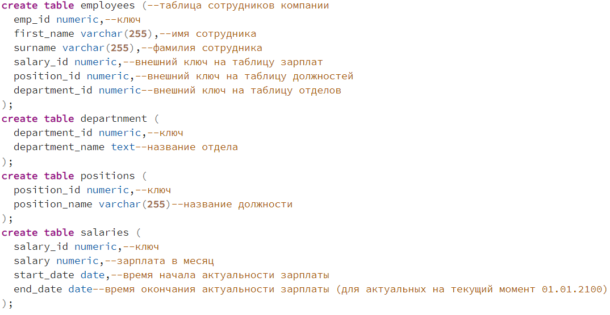
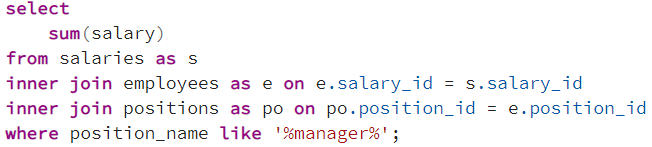
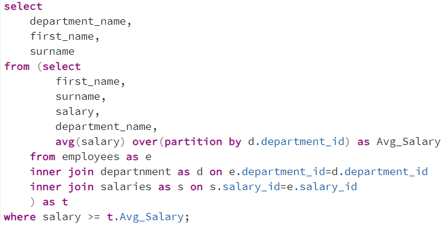
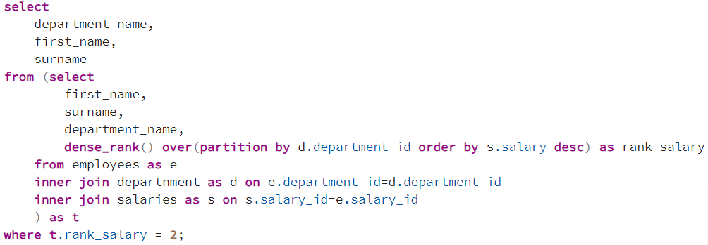

## Описание схемы данных

### 1. Напишите SQL-запрос, возвращающий cумму зарплат у сотрудников, в чьей должности содержится менеджер

### 2. Напишите SQL-запрос, возвращающий имена и фамилии сотрудников, чья зарплата больше или равна средней по отделу, в котором они работают

### 3. Напишите SQL-запрос, возвращающий имена и фамилии сотрудников, имеющих вторую по величине зарплату в своём отделе

