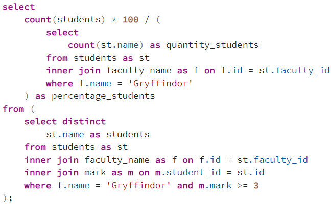

## Описание схемы данных

## Задания

### 1. Какие предметы сдают студенты, у которых факультет Gryffindor?

### 2. Какой процент студентов факультета Slytherin не сдали предмет "Defense Against the Dark Arts"?

### 3. Какой средний балл студентов факультета Hufflepuff по предмету "Charms"? Под "сдали" подразумевается оценка 3 и выше

### 4. Какой предмет лучше всего сдают студенты, у которых факультет Ravenclaw?

### 5. Какое количество студентов из каждого факультета сдали предмет "Herbology"? Под "сдали" подразумевается оценка 3 и выше

### 6. Какой процент студентов из факультета Gryffindor сдали хотя бы один предмет? Под "сдали" подразумевается оценка 3 и выше

### 7. Какое количество студентов получили хотя бы одну оценку выше 4 (из всех факультетов)?

### 8. Какие студенты получили хотя бы одну пятерку?

### 9. Какой предмет имеет самую высокую среднюю оценку?

### 10. Какое количество студентов учится в каждом факультете?

